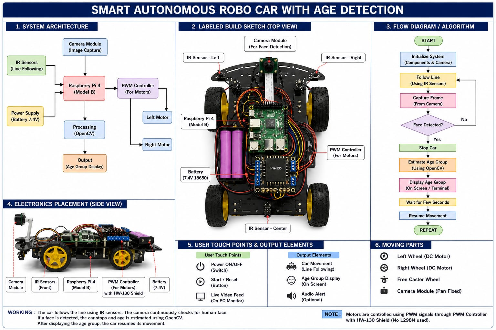
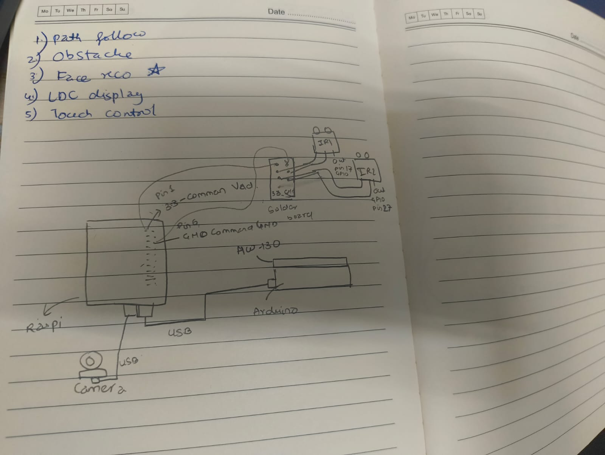
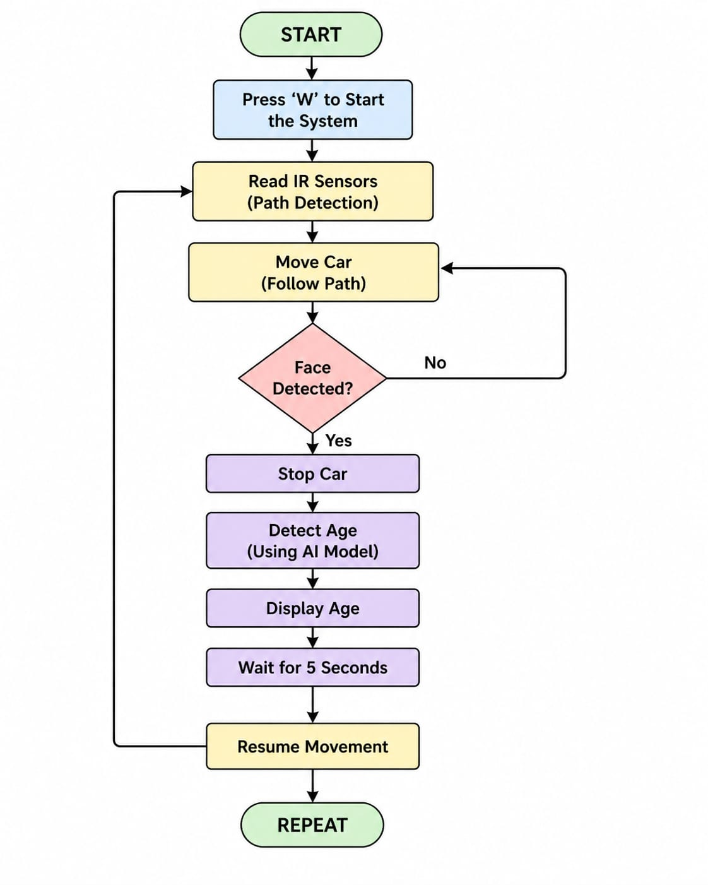
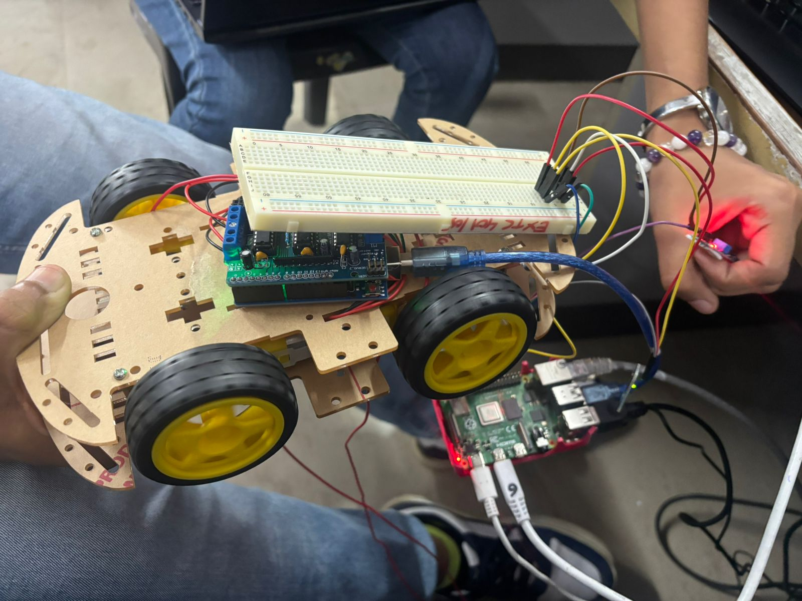

# SKILL LAB PRATICAL HACKATHON

## Final Project README

> **Project Weight:** 100%  
> **Team Size:** 4/3 students  
> **Project Duration:** 16 hours  
> **Total Time Available:** 32 effort-hours per team  
> **Project Type:** Playful, interactive, technology-based experience

---

# Before you begin

## Fork and rename this repository

After forking this repository, rename it using the format:

`SKILLLAB_PROR-2026-TeamName`

### Example

`SKILLLAB_PROR-2026-AuroWizards`

Do not keep the default repository name.

---

# How to use this README

This file is your team’s **working project document**.

You must keep updating it throughout the build period.  
By the final review, this README should clearly show:

- your idea,
- your planning,
- your design decisions,
- your technical process,
- your build progress,
- your testing,
- your failures and changes,
- your final outcome.

## Rules

- Fill every section.
- Do not delete headings.
- If something does not apply, write `Not applicable` and explain why.
- Add images, screenshots, sketches, links, and videos wherever useful.
- Update task status and weekly logs regularly.
- Use this file as evidence of process, not only as a final report.

---
# 1. Team Identity  

## 1.1 Studio / Group Name: 
Visionary Minds 

## 1.2 Team Members  

| Name | Primary Role | Secondary Role | Strengths Brought to the Project |
|------|--------------|----------------|----------------------------------|
| Mehar Jha | Documentation, PPT | Coding & Testing | Material Handling, Hardware Setup, Troubleshooting |
| Arpita Yaligeti | Electronics / Hardware Testing | Coding | Hardware Setup, Sensor Integration, Debugging, Circuit Assembly |
| Prashansa Vishe | Electronics / Coding | Documentation | Sensor Calibration, System Testing |
| Ansh Upadhyay | Electronics / Documentation | Material Handling | Material Handling, Hardware Assembly |

---

## 1.3 Project Title  
**Smart Robo Car with Path Following and Obstacle Detection**

(because we wanted to learn robotics and understand how smart vehicles detect paths and obstacles.)

---

## 1.4 One-Line Pitch  

An autonomous security assistant using computer vision and IR sensors to monitor restricted areas and provide real-time age-detection analytics.

---

## 1.5 Expanded Project Idea  

Our project is a 4WD robotic vehicle designed for surveillance in environments where human presence is restricted or physically demanding, such as high-altitude school corridors, industrial sites, or areas requiring 24/7 monitoring. The project creates a bridge between physical mobility and intelligent data recording by deploying a car on specific floors to act as a mobile sentry. It utilizes a Raspberry Pi for high-level logic and an Arduino for motor control, ensuring a stable and responsive drive system.

The experience centers on automated human detection. Equipped with a camera and OpenCV-powered face recognition, the car identifies individuals and currently estimates their age—a feature designed to log demographic data of visitors in schools or colleges. By replacing the need for elderly security personnel to climb stairs or navigate difficult terrain, Our RoboCar provides a safe, efficient, and recordable method of site security.

---

# 2. Inspiration  

## 2.1 References  

List what inspired the project.

| Source Type | Title / Link                                                        | What Inspired You                                                                         |
| ----------- | ------------------------------------------------------------------- | ----------------------------------------------------------------------------------------- |
|`[Project]`|`https://github.com/MichielBontenbal/RoboCar/tree/master`|`Create a robot car with a camera.`|
| `[Project]`| `[https://www.instagram.com/reel/DW4CT7WCDry/?igsh=cXg3dzAxYmdncDBo](https://github.com/GilLevi/AgeGenderDeepLearning/tree/master)` | `Implementing real-time age and gender detection using deep learning models on edge devices.` |
|`[Project]`|`[https://github.com/ArminJo/Arduino-RobotCar](https://youtu.be/RPDQvuAIhus?si=N5lOAUN0sSBaQyfA)`|`Making a Raspberry Pi Pico Bluetooth Control Car`|          

---

## 2.2 Original Twist  

Unlike standard remote-controlled cars, Our RoboCar focuses on "floor-specific" intelligence. It is specifically designed for multi-story institutions where it can be left to patrol a single level independently. The original twist lies in its demographic-logging feature (age detection), turning a simple surveillance camera into a data-gathering tool for institutional security.

---

# 3. Project Intent  

## 3.1 User Journey  

A security officer at a large university needs to monitor the 4th-floor labs after hours but cannot easily access the stairs due to physical constraints and the elevators is out of service or electricity is switched off after working hours. They deploy RoboCar on the 4th floor. As the car patrolys, it uses IR sensors to navigate around hallway obstacles. When a student enters the frame, the car's camera triggers a face-detection algorithm, estimates the student's age, and records the event. The officer receives this data remotely, allowing them to verify who is on-site without ever leaving the ground floor.

---

# 4. Definition of Success  

## 4.1 Definition of Usable  

The project is considered "usable" if the car can navigate a flat surface without colliding with obstacles (via IR sensors) while maintaining a stable camera feed that correctly identifies a human face and displays an age estimate on the local monitoring screen.

---

## 4.2 Minimum Usable Version  

- Motors move correctly  
- IR sensors follow line and to avoid crashes   
- Car stops recognizes the age of the human
- Stalls and then starts the movement again  

---

## 4.3 Stretch Features  

- Human-following mode (controlling the car via body position/gestures).
- Full database logging of recognized faces with time-stamps.
- Automated stair-climbing or elevator-calling integration. 
- Mobile control

---

# 5. System Overview  

## 5.1 Project Type  

- [x] Electronics-based
- [ ] Mechanical
- [x] Sensor-based
- [ ] App-connected
- [x] Motorized
- [ ] Sound-based
- [x] Light-based
- [ ] Screen/UI-based
- [x] Fabricated structure
- [ ] Game logic based
- [ ] Installation (Surveillance) 

---

## 5.2 High-Level System Description  

The system works using sensors and motors controlled by Raspberry Pi.

**Input:**  
- Visual Data: A USB camera captures live frames, focusing on human presence.
- Proximity Data: Dual IR sensors provide real-time distance measurements to detect obstacles  
- Control Input: The system accepts serial commands for Start/Stop.  

**Processing:**  
- Primary Logic (Raspberry Pi): Acts as the high-level controller, running Python-based scripts to process video and perform subtle age detection via OpenCV.
- Motor Control (Arduino): Acts as the hardware interface, translating serial commands from the Pi into motor pulses while monitoring IR sensor interrupts for safety.  

**Output:**  
- Physical Motion: Four BO motors execute movement (Forward, Reverse, Right and Left).
- Safety Response: The motors are automatically disabled if the IR sensors detect an immediate collision risk.
- Information: The system outputs detects the estimated age data.
   
**Physical Structure:**
- Chassis: A 4WD mobile platform with a dual-tier arrangement.
- Component Placement: The motors are all placed at the bottom and the Hw-130 aurdino sheild at he top centre for stability, while the Pi "brain" at the top back and camera sit on the top front for a clear field of view.
---

## 5.3 Input / Output Map  

| System Part | Type | What It Does |
|-------------|------|---------------|
| IR Sensor | Input | Detects path |
| Raspberry Pi | Processing | Controls logic |
| HW-130 Motor Shield | Output | Drives motors |
| USB Camera | Input | Captures live video feed |
| Serial Connection (USB) | Input/Output | Communication bridge|
|Li-ion Battery Pack| Power | Voltage and current to drive both the processing boards and the high-draw motors |

---

# 6. System Design, Sketches and Visual Planning 

## 6.1 Concept Architecture/sketch/schematic

Add an early sketch of the full idea.

**Insert image below:**  
`[Upload image and link here]`

## 6.2 Labeled Build Sketch/architecture/flow diagram/algorithm

Add a sketch with labels showing:

- structure,
- electronics placement,
- user touch points,
- moving parts,
- output elements.

**Insert image below:**  
`[Upload image and link here]`

## 6.3 Approximate Dimensions

| Dimension        | Value   |
| ---------------- | ------- |
| Length           | `25.5 cm` |
| Width            | `15 cm` |
| Height           | `12 cm`  |
| Estimated weight | `350-450 g` |

---

# 7. Electronics Planning  

## 7.1 Electronics Used  

| Component | Quantity | Purpose |
|----------|----------|--------|
| Raspberry Pi | 1 | High-level logic & Face Recognition |
| Arduino Uno | 1 | Low-level motor control |
|HW-130 Motor Shield| 1 | Interface for 4 BO Motors |
| BO Motors + wheels | 4 | 4WD Movement |
| IR Sensors | 2 | Path detection |
| USB | 1 | Visual data for age detection |

---

## 7.2 Wiring Plan  
- The Raspberry Pi is connected to Arduino using USB to generate pwm singnals for motor.
- The Arduino has hw130 sheild (L298N for arduino) that controls the motors.
- The Web cam is connected to the Raspi using USB port.
- The IR sensors are connected to input GPIO pins (17 , 27) to detect the line path.  
- All components share a common ground and Vdd for stable operation.

---

## 7.3 Circuit Diagram/architecture diagram

Insert a hand-drawn or software-made circuit diagram.

**Insert image below:**  
`[Upload image and link here]`

# 7.4. Power Plan

| Question         | Response                                                                                                                                          |
| ---------------- | ------------------------------------------------------------------------------------------------------------------------------------------------- |
| Power source     | `DC Power Supply` |
| Voltage required | `~9-12V for motors (via HW-130 driver)`|
| Current concerns | `Motors can draw high current under load, which may cause Raspi to shut down if not enough voltage power supplied wirelessly`|
| Safety concerns  | `Excess power me damage the raspi and extra load on it due to drivers and usb` |

---

# 8. Software Planning/

## 8.1 Software Tools

| Tool / Platform                | Purpose                                        |
| ------------------------------ | ---------------------------------------------- |
| `Python 3`                | `Main programming language for logic and AI integration.`|
| `OpenCV (cv2)`       | `Used for real-time video capture, face detection (Haar Cascades), and DNN inference.` |
| `Caffe Models` | `Pre-trained Deep Neural Networks used for Gender and Age classification.`                      |
| `RPi.GPIO`|`Python library to interface with the hardware IR sensors on the Raspberry Pi pins.`|
|`PySerial`|`Enables communication between the Raspberry Pi and the Arduino/Motor Controller.`|
|`Threading`|`Allows the AI vision, keyboard input, and motor logic to run simultaneously without lagging.`|

## 8.2 Software Logic/Algorithm

The software is built on a multi-threaded architecture to ensure that heavy AI processing does not interfere with real-time motor safety.

- **Startup:**  
 - The system initializes Serial communication (/dev/ttyACM0 or ttyUSB0).
 - GPIO pins are configured for the IR sensors.
 - The pre-trained Caffe models (Age and Gender nets) and Haar Cascade classifiers are loaded into memory.

- **Input Handling:**  
  - Keyboard Thread: Listens for 'W' (Start), 'S' (Stop), or 'Q' (Quit) using termios for raw input.
  - Vision Thread: Captures frames (optimized for Pi performance).
  - Sensor Polling: The main loop constantly checks IR sensor states (high/low).

- **Decision Logic:**  
  - Keyboard Thread: Listens for 'W' (Start), 'S' (Stop), or 'Q' (Quit) using termios for raw input.
  - Vision Thread: Captures frames (optimized for Pi performance).
  - Sensor Polling: The main loop constantly checks IR sensor states (high/low).  

- **Navigation Logic (IR Path Following):**
  - Forward ('F'): Both IR sensors detect the path.
  - Left/Right ('L'/'R'): One sensor detects an edge, triggering a corrective turn.
  - Stop ('S'): Both sensors lose the path or the AI triggers a stall.

- **Output Behavior:**  
  - Single-byte characters are sent via Serial to the Arduino to drive the motors.
  - A visual "Car Vision" window displays green bounding boxes around faces with age/gender text overlays.
    
- **Reset Behavior:**  
  Pressing 'Q' or a KeyboardInterrupt triggers a safety stop command and cleans up the GPIO pins before exiting.
  
---
## 8.3 Code Flowchart

Insert a flowchart showing your code logic.

Suggested sequence:

- start,
- initialize,
- wait for input,
- read input,
- decision,
- trigger output,
- repeat or reset,
- error handling.

**Insert image below:**  

# 9. Bill of Materials

## 9.1 Full BOM

| Item                             | Quantity | In Kit? | Need to Buy? | Estimated Cost | Material / Spec               | Why This Choice?          |
| -------------------------------- | --------:| ------- | ------------ | --------------:| ----------------------------- | ------------------------- |
| `[RASPI]`                        | `1`      | `Yes`   | `No`         | `0`            | `38 Pin ESP32`                | `[To control components]` |
| `[HW-130 Sheild]`                 | `[1]`    | `[Yes]` | `[No]`       | `0`            | `[L298N]`                     | `[To drive both motors]`  |
| `[Arduino Uno]`                 | `[1]`    | `[Yes]` | `[No]`       | `0`            | `[Microcontroller	ATmega328P, 14 GPIO pins (6 provide PWM output for motor speed control)]`                     | `[To generate PWM for motorss]`  |
| `[IR sensors]`                 | `[2]`    | `[Yes]` | `[No]`       | `0`            | `[Digital (High/Low) — compatible with Pi GPIO and Arduino]`                     | `[Fast response detection]`  |
| `[DC Motors and wheel]`          | `[4]`    | `[Yes]`  | `[No]`      | `[0]`        | `[BO Motors and 7 cm wheels]` | `[high torque motors]`    |
| `[Female and male headers]`               | `[1 pack]`    | `[No]`  | `[Yes]`      | `[80]`         |                              |        `For soldering`                   |
| `[Battery holder]` | `[1]`    | `[Yes]`  | `[No]`      | `[0]`        |  |          |
| `[Battery AA]` | `[4]`    | `[No]`  | `[Yes]`      | `[120]`        |  |          |

## 9.2 Material Justification

Explain why you selected your main materials and components.

`The decision to use 4WD BO motors instead of servos or steppers was driven by the need for continuous movement and high torque to support the weight of two microcontrollers (Pi and Arduino). Since we transitioned to a camera-based tracking system, precise step-counting (which steppers provide) became less critical than overall mobility. The HW-130 shield was specifically chosen to simplify the 4WD wiring, as it allows us to control all four motors from a single Arduino interface using PWM for speed regulation. Using a Raspberry Pi for AI and an Arduino for hardware prevents the AI's high processing load from causing delays in motor safety responses.`

## 9.3 Items You chose

| Item                 | Why Needed               | Purchase Link | Latest Safe Date to Procure | Status       |
| -------------------- | ------------------------ | ------------- | --------------------------- | ------------ |
| `AA Batteries` | `Motor power source`   | `Local Store`     | `Day of testing`                | `[Received]` |
| `Header Pins`   | `Connect GPIO pins with sensors and Raspi pi pins `         | `local store` | `Day of testing`            | `Recieved`   |

## 9.4 Budget Summary

| Budget Item           | Estimated Cost              |
| --------------------- | ---------------------------:|
| Electronics (Pi, Arduino, Sensors)          | `[0]`                     |
| Mechanical parts (Motors, Chassis)     | `[0]`                     |
| Power (Batteries) | `[120]` |
| Small components (Wires, Headers)      | `[80]`                       |
| Contingency (Spares)           | `[100]`                     |
| **Total**             | `[300]`                     |

## 9.5 Budget Reflection

The current budget is extremely efficient as most core components (Raspberry Pi, Arduino, and Motors) were provided in the project kit. If additional costs were to arise, we could reduce the contingency fund or use existing campus resources for wiring and soldering. The primary expense remains high-quality batteries, as the 4WD system and high-level processing on the Pi draw significant current, making power the one area where we cannot compromise.
 
---

# 10. Planning the Work

## 10.1 Team Working Agreement

Write how your team will work together.

Include:

- how tasks are divided,
- how decisions are made,
- how progress will be checked,
- what happens if a task is delayed,
- how documentation will be maintained.

**Response:**  

## 10.2 Task Breakdown

| Task ID | Task                    | Owner    | Estimated Hours | Deadline     | Dependency | Status |
| ------- | ----------------------- | -------- | ---------------:| ------------ | ---------- | ------ |
| T1      | `[Finalize concept]`    | `[Both]` | `2`             | `1st April`  | `None`     | `Done` |

## 10.3 Responsibility Split

| Area                 | Main Owner     | Support Owner |
| -------------------- | ----------     | ------------- |
| Concept              | `[Arpita]`  | `[Prashansa, Meher]`     |
| Electronics          | `[Arpita, Prashansa]`           | `[Meher, Ansh]`          |
| Coding               | `[Arpita]`           | `[Prashansa]`          |
| Mechanical build     | `[Arpita]`           | `[Meher]`          |
| Testing              | `[Prashansa]`           | `[Meher, Ansh, Arpita ]`          |
| Documentation        | `[Meher]`           | `[Ansh, Arpita]`          |

---

## 11 Hours milestone

## 11.1 6-hour Plan

### Bi Hour 1 — Plan and De-risk

Expected outcomes:

- [x] Idea finalized
- [x] Core interaction decided
- [x] Sketches made
- [x] BOM completed
- [x] Purchase needs identified
- [ ] Key uncertainty identified
- [ ] Basic feasibility tested

### Bi Hour 2 — Build Subsystems

Expected outcomes:

- [X] Electronics tests completed
- [ ] CAD / structure planning completed (NA)
- [ ] App UI started if needed (NA)
- [ ] Mechanical concept tested
- [ ] Main subsystems partially working

### Bi Hour 3 — Integrate

Expected outcomes:

- [X] Electronics tests completed
- [ ] CAD / structure planning completed (NA)
- [ ] App UI started if needed(NA)
- [X] Mechanical concept tested
- [x] Main subsystems partially working

### Bi Hour 4 — Update

Expected outcomes:

- [x] Physical body built
- [x] Electronics integrated
- [x] Code connected to hardware
- [ ] App connected if required
- [x] Wheels with raspi working version build

### Bi Hour 5 — Update

Expected outcomes:

- [ ] Technical bugs reduced
- [ ] Playtesting completed
- [ ] Improvements made
- [ ] Documentation completed
- [X] Wheels with raspi and Ir working version build

### Bi Hour 6 — Refine and Finish

Expected outcomes:

- [x] Technical bugs reduced
- [x] Testing completed
- [ ] Improvements made
- [X] Documentation completed
- [x] Partial build ready

---

## 12 Update Log 

| Hour   | Planned Goal   | What Actually Happened | What Changed   | Next Steps     |
| ------ | -------------- | ---------------------- | -------------- | -------------- |
|  1 | `[Plan and De-risk]` | `[Finalized surveillance idea, completed sketches and BOM.]`         | `[Identified need for Pi/Arduino Serial stability.]` | `[Start subsystem tests]` |
|  2 | `[Build Subsystems]` | `[Electronics tested; Pi-to-Arduino communication verified.]`         | `[Decided on a dual-power setup for Pi and motors.]` | `[Assemble chassis.]` |
|  3 | `[Integrate]` | `[Chassis assembled; Pi and Arduino mounted and partially working.]`         | `[Adjusted motor placement for 4WD weight distribution.]` | `[Code hardware connection.]` |
|  4 | `[Update]` | `[Physical body built and electronics integrated; wheels working with Raspi.]`         | `[Optimized Serial command delay for smoother driving.]` | `[Integrate IR sensors]` |
|  5 | `[Update]` | `[Wheels working with Raspi and IR sensors; AI Stall logic implemented.]`         | `[Added 2s cooldown to AI detection loop.]` | `[Final playtesting.]` |
|  6 | `[Refine and Finish]` | `[Bugs reduced; testing and documentation completed.]`         | `[Refined face-detection resolution for better frame rates.]` | `[Project ready for demo.]` |

---

# 13. Risks and Unknowns

## 13.1 Risk Register

| Risk                                                            | Type         | Likelihood | Impact   | Mitigation Plan                                                                       | Owner                |
| --------------------------------------------------------------- | ------------ | ---------- | -------- | ------------------------------------------------------------------------------------- | -------------------- |
| Serial lag between Pi and Arduino       | `Technical`  | `Medium`   | `High`   | Use 9600 baud rate and small command delays (0.02s). | `[Arpita]`           |
| Age detection lag on Pi hardware      | `Technical`  | `Medium`   | `Medium`   | KReduce camera resolution to 320x240 for faster inference. | `[Prashansa, Meher]`           |
|Voltage drop during motor start      | `Technical`  | `High`   | `High`   | Separate power source for Pi (Power Bank) and Motors (AA Pack). | `[Meher, Ansh]`           |

## 13.2 Biggest Unknown Right Now

The primary uncertainty is the accuracy and processing lag of the age-detection model when running on the Raspberry Pi hardware in real-time, especially in variable lighting conditions typical of school hallways. And running raspi wirelessly with power supply if less or finished might stop the working of raspi 

---

# 14. Testing 

## 14.1 Technical Testing Plan

| What Needs Testing | How You Will Test It | Success Condition |
| :--- | :--- | :--- |
| `Serial Link` | `Send movement commands ('W', 'S') from the Raspberry Pi keyboard thread.` | `The Arduino receives the characters via Serial and triggers the motors instantly.` |
| `IR Path Detection` | `Place the car on a path with obstacles on the left and right sides.` | `The car turns away from obstacles and stops if both sensors are triggered.` |
| `AI Stall Logic` | `Present a human face to the USB camera while the car is in motion.` | `The car stops immediately, performs a 5-second age/gender scan, and logs data.` |
| `Power Stability` | `Run the AI vision thread and 4WD motors simultaneously for 10 minutes.` | `The Raspberry Pi maintains a stable connection without rebooting or lagging.` |

## 14.2 Testing and Debugging Log

| Hour | Problem Found | Type | What You Tried | Result | Next Action |
| :--- | :--- | :--- | :--- | :--- | :--- |
| `1-2` | `Car motors not working with standalone HW130` | `Techanical` | `Used arduino as base to run and generate the pwm` | `Worked` | `Handle power and run motors more steadily` |
| `2-3` | `Serial buffer lag` | `Software` | `Added 0.02s delay in the main navigation loop` | `Success` | `Standardize baud rate at 9600` |
| `3-5` | `False IR triggers` | `Electronics` | `Adjusted onboard potentiometer sensitivity` | `Resolved` | `Test in variable hallway lighting` |
| `5-6` | `Age detection latency` | `Software` | `Reduced camera resolution to 320x240` | `Worked` | `Finalize multi-threading logic` |

## 14.3 Playtesting Notes

| Tester | What They Did | What Confused Them | What They Enjoyed | What You Will Change |
| :--- | :--- | :--- | :--- | :--- |
| `Ansh` | `Navigated through hallways` | `Wait time during age scan felt like a software crash` | `The way the car "paused" to identify him` | `Add terminal print: "Scanning... Please wait"` |
| `Meher` | `Tested IR safety stop` | `Car stopped too late at higher speeds` | `The automatic stop mechanism` | `Increase IR sensor mounting angle outward` |
| `Arpita and Prashansa` | `Observed age detection` | `Age estimate flickered between categories` | `Seeing the bounding box on the monitor` | `Implement result freezing during the 5s stall` |

---

# 15. Build Documentation

## 15.1 Fabrication Process(if any)

Describe how the project was physically made.

Include:

- cutting (NA),
- 3D printing (NA),
- assembly,
- fastening(NA),
- wiring,
- finishing,
- revisions.

**Response:**  
`Assembly: The project was built using a dual-tier chassis approach to separate the "brain" from the "muscle." The base level was assembled by mounting four BO motors to the chassis frame to establish the 4WD system. The Arduino Uno, equipped with the HW-130 motor shield, was positioned in the center of the bottom tier to ensure even weight distribution. The Raspberry Pi was then mounted on a secondary upper platform, providing the USB camera with an elevated vantage point for clearer face detection.`

`Wiring: The wiring followed a strict separation protocol to prevent electrical noise from the motors from resetting the microcontrollers. 
    - Logic Link: A USB cable was used for Serial communication between the Raspberry Pi and Arduino.
    - Power Rails: The Raspberry Pi was powered by a dedicated 5V power bank. The motors and Arduino were powered by a 4-slot AA battery pack connected directly to the HW-130 shield's power terminals.
    - Sensors: IR sensors were wired to the Raspberry Pi's GPIO pins (17 and 27) for path monitoring, while the motor driver inputs were mapped to the Arduino’s digital PWM pins.`

`Finishing: To ensure the build was field-ready for school hallways, all loose jumper wires were secured using cable ties and adhesive clips to prevent them from tangling in the wheels. The camera was tilted at a slight downward angle to optimize the capture frame for both adults and children, and the IR sensors were calibrated via their onboard potentiometers to respond to the specific reflectivity of the campus floor.`
 
 `Revisions: The physical design underwent one major revision. Initially, the Raspberry Pi was on the same level as the motors, but the vibrations and low camera angle led to poor face recognition. Moving the Pi to a "top-tier" platform significantly improved the stability of the OpenCV feed. Additionally, the IR sensor mounts were adjusted from a straight-forward position to a slight outward angle to improve the car's "peripheral vision" during turns.`

## 16 Build Photos

Add photos throughout the project.

Suggested images:

- early sketch,
- prototype,
- electronics testing,
- mechanism test,
- app screenshot(NA),
- final build.
- 
- 

# 17. Final Outcome  

## 17.1 Final Description  

The final project is a compact, 4WD autonomous vehicle housed in a custom-fabricated chassis. It successfully integrates a Raspberry Pi and Arduino to perform  the robo car to move as needed with the help of ir sensors and real-time age estimation and surveillance. 

---

## 17.2 What Works Well  

- Accurate line following  
- Reliable obstacle detection
- Stable motor environment

---

## 17.3 What Still Needs Improvement  
  
- Sensor accuracy  
- Improve battery life
- Make wireless 

---

## 17.4 What Changed From Original Plan  

Originally, we intended to implement a gesture-based control system where the car would move based on a human's physical position. However, due to time constraints and the complexity of mapping spatial coordinates to motor logic, we pivoted to perfecting the face recognition and age detection features.

---

# 18. Reflection  

## 18.2 Technical Reflection  

We gained significant experience in inter-board communication (Serial between Pi and Arduino) and the nuances of power management—specifically how high-current motor draws can cause logic brownouts if not properly regulated.

---

## 18.4 If You Had One More Hour  

We would add WiFi control to manually control the robo car from a laptop, and add face recognition accurately.

